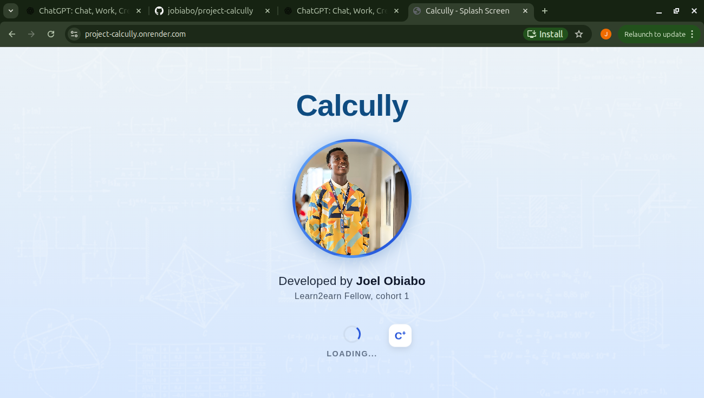
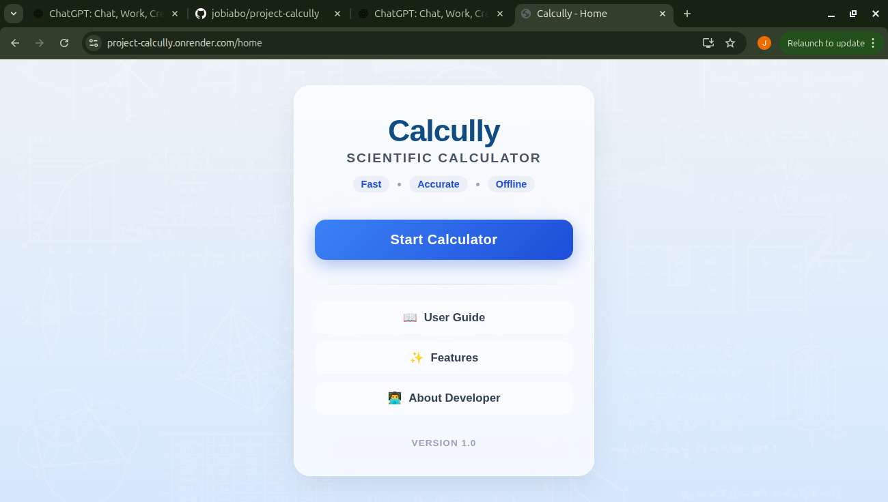
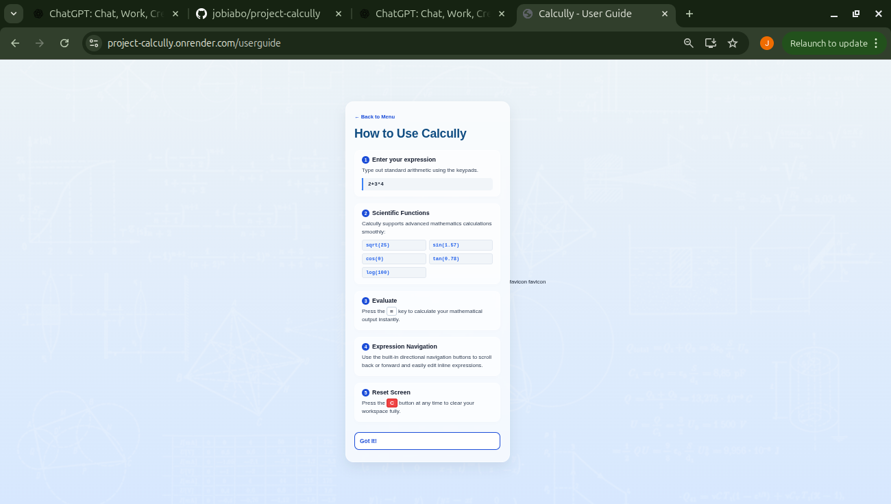
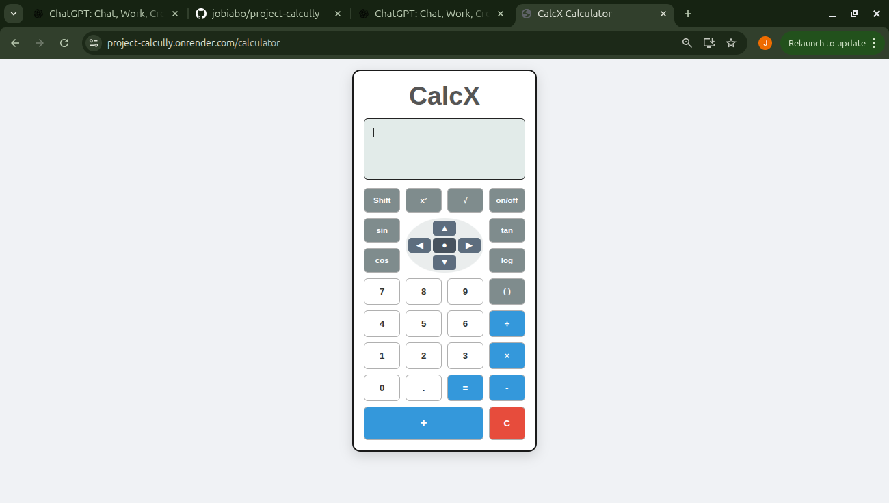
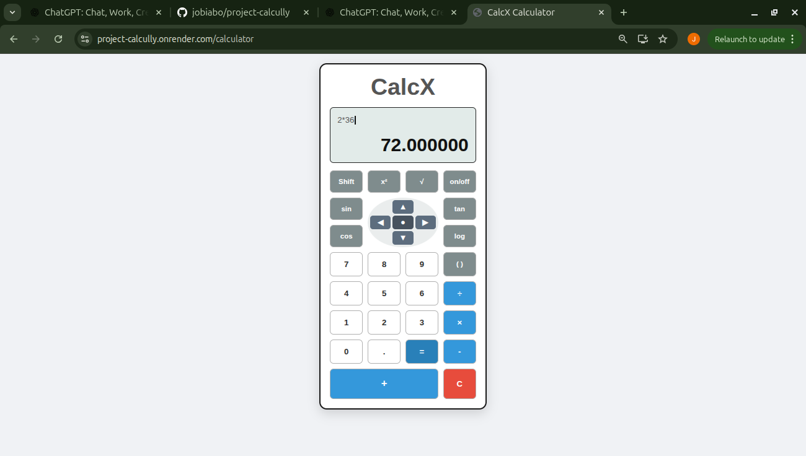
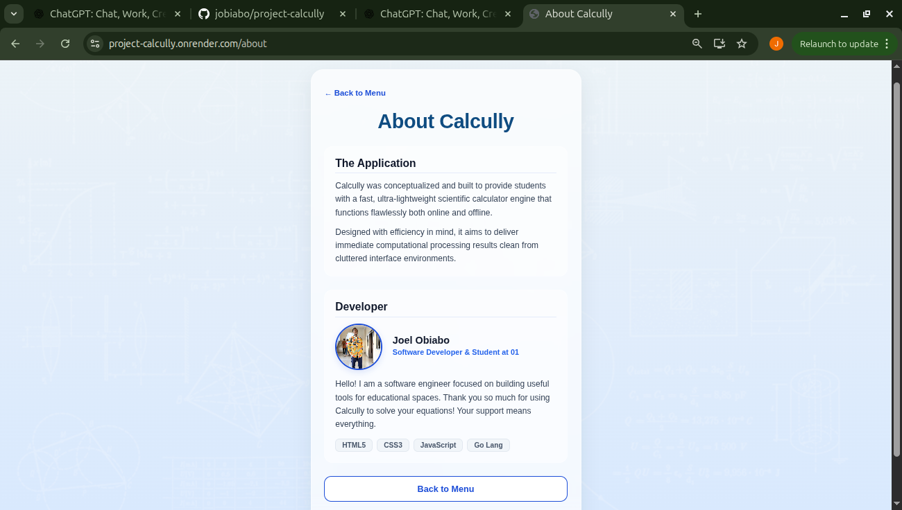

# Calcully

A lightweight scientific calculator built with **Go**, featuring an interactive web interface and support for both basic arithmetic and scientific operations.

Calcully was designed to provide students, developers, and everyday users with a fast, accurate, and easy-to-use calculator that runs directly in the browser.

---

## 📸 Preview

> 
> 
> 
> 
> 
> 
> 


---

## ✨ Features

### Basic Arithmetic
- Addition
- Subtraction
- Multiplication
- Division

### Scientific Functions
- Square Root (`sqrt`)
- Sine (`sin`)
- Cosine (`cos`)
- Tangent (`tan`)
- Logarithm (`log`)
- Power (`pow`)

### User Experience
- Beautiful splash screen
- Home page navigation
- User Guide
- Features page
- About page
- Expression display
- Error handling
- Clean and responsive interface

---

## 🛠 Built With

- Go
- HTML5
- CSS3
- JavaScript
- Go Templates

---

## 📁 Project Structure

```
project-calcully/
│
├── calcully/
│   ├── solve.go
│   ├── check.go
│   ├── sqrt.go
│   ├── sine.go
│   ├── cos.go
│   ├── tan.go
│   ├── log.go
│   └── pow.go
│
├── handlers/
│   ├── splashpagehandler.go
│   ├── homehandler.go
│   ├── CalcXPageHandler.go
│   ├── userguide.go
│   ├── features.go
│   └── abouthandler.go
│
├── template/
│   ├── splashpage.html
│   ├── homepage.html
│   ├── calculator.html
│   ├── userguide.html
│   ├── features.html
│   └── aboutpage.html
│
├── static/
│
├── main.go
└── go.mod
```

---

## 🚀 Getting Started

### Clone the Repository

```bash
git clone https://github.com/jobiabo/project-calcully.git
```

### Navigate into the Project

```bash
cd project-calcully
```

### Run the Application

```bash
go run .
```

Open your browser and visit:

```
http://localhost:8080
```

---

## 📖 Application Pages

- Splash Screen
- Home
- Calculator
- User Guide
- Features
- About Developer

---

## 🧠 How It Works

The calculator processes expressions through multiple stages:

```
User Input
      │
      ▼
Expression Validation
      │
      ▼
Tokenization
      │
      ▼
Scientific Function Detection
      │
      ▼
Expression Evaluation
      │
      ▼
Display Result
```

Scientific functions are handled individually before evaluation, allowing the application to remain modular and easier to maintain.

---

## ⚠ Error Handling

Calcully validates user input and handles invalid mathematical expressions gracefully.

Examples include:

- Invalid syntax
- Empty input
- Invalid logarithms
- Invalid square roots
- Mathematical errors

---

## 🎯 Future Improvements

- Expression history
- Keyboard shortcuts
- Degree/Radian toggle
- Memory functions
- Themes
- Progressive Web App (PWA)
- Android APK
- More scientific functions

---

## 👨‍💻 About the Developer

Hi, I'm **Joel**.

I'm a software developer and a student at **01** who enjoys solving problems through software engineering.

Calcully is one of my projects built to strengthen my understanding of:

- Go
- Algorithms
- Expression parsing
- Backend development
- Frontend integration
- Scientific computation

This project represents my journey from building a simple calculator capable of handling only two operands to developing a complete scientific web calculator with a structured architecture and multiple user interface pages.

---

## 📄 License

This project is open source and available under the MIT License.

---

## ⭐ Support

If you found this project helpful or interesting, consider giving it a ⭐ on GitHub/Gitea.


## 📚 What I Learned

Building Calcully helped me deepen my understanding of:

- Parsing mathematical expressions
- Writing reusable Go code
- Separating business logic from HTTP handlers
- Building multi-page web applications
- Designing user-friendly interfaces
- Structuring a Go project for maintainability


## 🌐 Live Demo

https://project-calcully.onrender.com